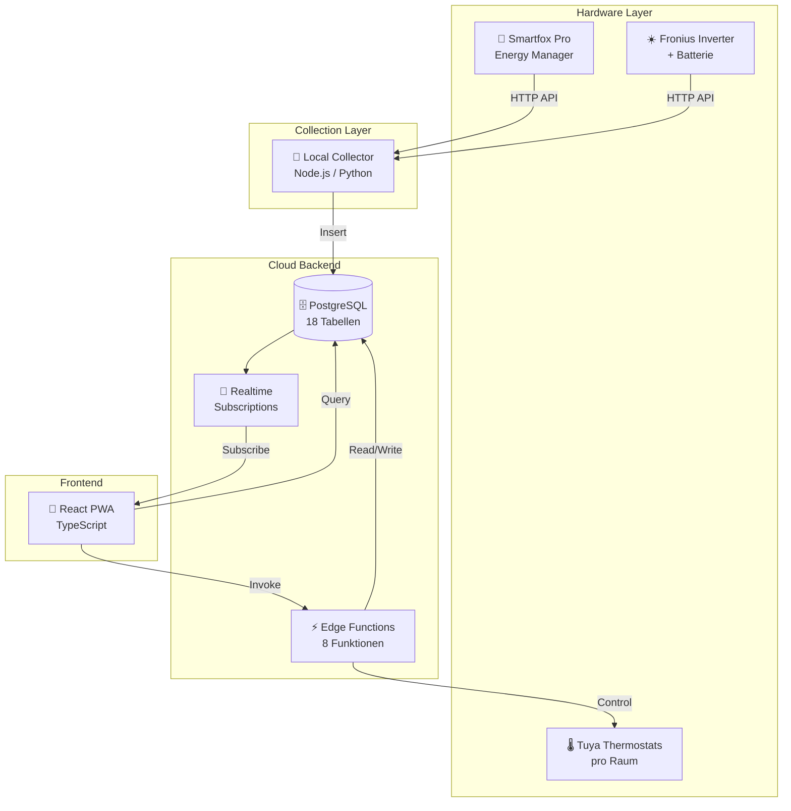
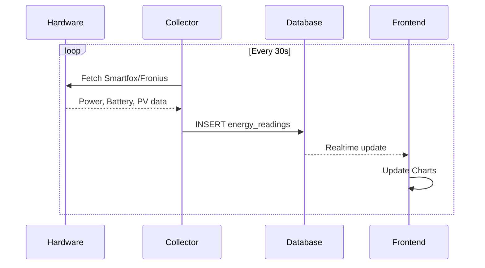
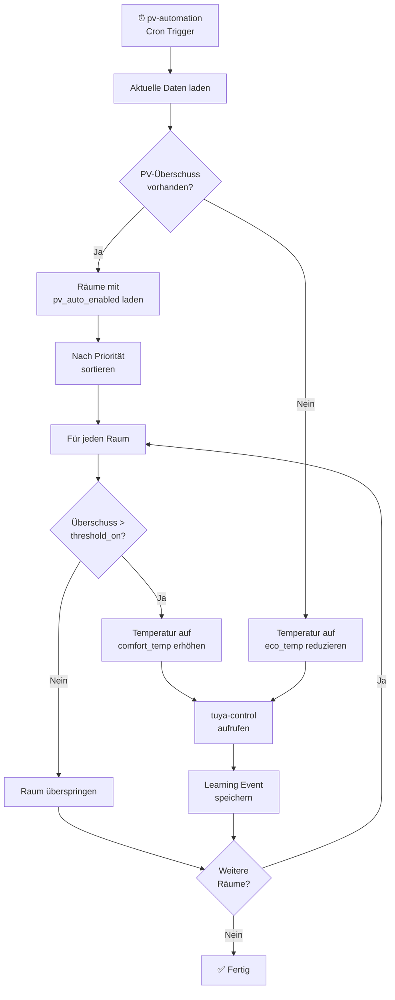
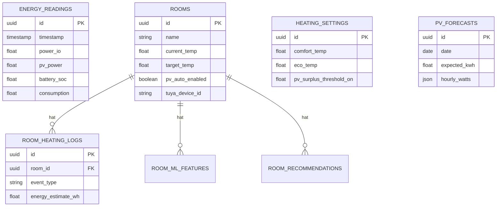
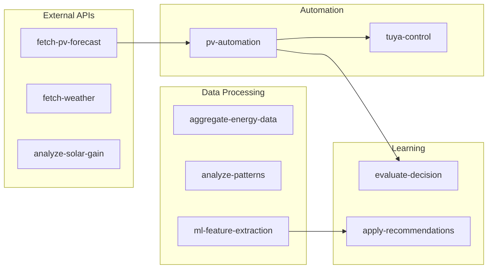

# Architektur-Übersicht

Visuelle Darstellung der Systemarchitektur mit Mermaid-Diagrammen.

---

## Gesamtsystem



---

## Datenfluss: Energy Readings



---

## Heizungs-Automatik Ablauf



---

## Datenbank-Schema (vereinfacht)



---

## Edge Functions Übersicht



---

## Technologie-Stack

| Layer | Technologie | Zweck |
|-------|-------------|-------|
| Frontend | React 18 + TypeScript | UI-Framework |
| Styling | Tailwind CSS + shadcn/ui | Design System |
| State | TanStack Query | Server State |
| Charts | Recharts | Visualisierung |
| PWA | Vite PWA Plugin | Offline Support |
| Backend | Supabase Edge Functions | Serverless Logic |
| Database | PostgreSQL | Datenspeicherung |
| Realtime | Supabase Realtime | Live Updates |
| Auth | Supabase Auth | Authentifizierung |
| Hardware | Smartfox, Fronius, Tuya | Energie + Heizung |

---

## Ordnerstruktur

```
├── .lovable/              # Dokumentation
│   ├── SYSTEM_DOCUMENTATION.md
│   ├── CHANGELOG.md
│   ├── ARCHITECTURE.md
│   └── TODO.md
├── local-collector/       # Datensammler
│   ├── collector.py       # Python-Version
│   └── collector-node/    # Node.js-Version
├── src/
│   ├── components/
│   │   ├── energy/        # Energie-Dashboard
│   │   ├── heating/       # Heizungs-Steuerung
│   │   └── ui/            # shadcn Komponenten
│   ├── hooks/             # React Hooks
│   ├── pages/             # Routen
│   └── types/             # TypeScript Types
└── supabase/
    └── functions/         # Edge Functions
```
